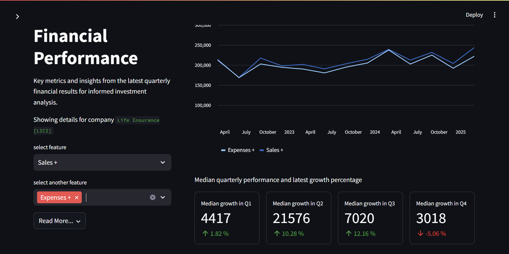

# 📈 Stock Finder

**Stock Finder** is a powerful and intuitive stock analysis tool built with **Python** and **Streamlit**. It enables users to fetch the latest financial data, visualize key performance indicators (KPIs), and get intelligent stock recommendations — all in one interactive dashboard.



---

## 🚀 Features

- **Live Financials**: Automatically fetches the latest stock financials from the web.
- **Multi-KPI Plotting**: Plot multiple KPIs across time for a comprehensive financial overview.
- **Stock Summary**: Get a clear, concise summary of how your selected KPIs are performing.
- **EMA-Based Recommendation Engine**:
  - Uses **50-week** and **100-week** Exponential Moving Averages.
  - Provides buy/sell/hold suggestions based on EMA crossover signals.
- **Streamlit Interface**: Clean, fast, and interactive UI for seamless user experience.

---

## 🏗️ Folder Structure

```

.
├── app.py                # Entry point for Streamlit app
├── assets/               # Static assets like images or icons
├── data/                 # Raw or intermediate data files
├── database/             # Local or cached database files
├── dump/                 # Any temporary or intermediate dump files
├── logs/                 # Logging output
├── md/                   # Markdown summaries or documentation
├── models/               # database models
├── notebooks/            # Jupyter notebooks for exploration and analysis
├── pages/                # Streamlit multipage components
├── scrapper/             # Web scraping scripts to pull financials
├── utils/                # Helper functions and utility scripts
├── .streamlit/           # Streamlit configuration
├── requirements.txt      # Python dependencies
├── Pipfile / Pipfile.lock# Alternative dependency management
├── README.md             # Project documentation
└── .gitignore            # Git ignored files

````

---

## ⚙️ Installation

### 📦 Requirements

- Python 3.8+
- pip or pipenv

### 🛠️ Setup

```bash
# Clone the repo
git clone https://github.com/your-username/stock-finder.git
cd stock-finder

# Install dependencies
pip install -r requirements.txt

# Or using pipenv
pipenv install
````

---

## ▶️ Run the App

```bash
streamlit run app.py
```

---

## 🤝 Contributing

Contributions are welcome! Please fork the repo and open a pull request. If you find a bug or have a feature request, open an issue.

---

## 🧠 Tech Stack

* **Frontend**: Streamlit
* **Backend**: Python
* **Data Fetching**: Web scraping (BeautifulSoup, Selenium, etc.)
* **Plotting**: Matplotlib / Plotly / Altair (based on your implementation)

---

## 📄 License

This project is licensed under the MIT License.

## Contact

For any questions or feedback, please reach out to [work.soumyadipghorai@gmail.com](mailto:work.soumyadipghorai@gmail.com).

---

Happy Investing!
